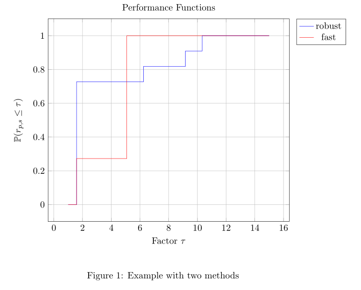

.. image:: https://travis-ci.org/PHPirates/perf.svg?branch=master
    :target: https://travis-ci.org/PHPirates/perf
    :alt: Travis

====
perf
====

Usage
-----

An example file is in `src/usage-example.tex`.
An even more minimal example is

```
\documentclass[11pt]{article}
\usepackage{perf}

\begin{document}

    % Set data to be used. Can be reset anywhere.
    \perfset{
    method1 method2 \\
    1     2 \\ % These numbers are the performances on problem 1
    3     4 \\ % Problem 2
    }

    \begin{tikzpicture}
        \begin{axis}[title=Performance Functions,height=10cm,
        legend pos=outer north east,grid=both,no marks, xlabel={Factor $\tau$}, ylabel={Estimated probability}]
            \addprofiles{2}{15} % Param #1: Number of methods to show. Param #2: Upper range for the x axis
            \legend{method1, method2}
        \end{axis}
    \end{tikzpicture}

\end{document}
```

It has output



Plot performance profiles in LaTeX
----------------------------------

From an original `post by @percusse <https://tex.stackexchange.com/a/197349/98850>`_, made into a more easily usable package.

Download
--------

.. image:: https://img.shields.io/github/release/PHPirates/perf.svg?maxAge=259200
    :target: https://github.com/PHPirates/perf/releases/latest
    :alt: Release

This repo includes an `example file <src/usage-example.tex>`_.

Performance profiles?
---------------------

A good explanation of performance profiles is given by `Dolan, E. D., & Moré, J. J. (2002). Benchmarking optimization software with performance profiles. Mathematical programming, 91(2), 201-213.  <https://arxiv.org/pdf/cs/0102001.pdf>`_

|
|
|
|
We try to adhere to `Semantic Versioning <http://semver.org/>`_, an update of the first version digit means that you may need to update your LaTeX because some backwards incompatible changes were made.


